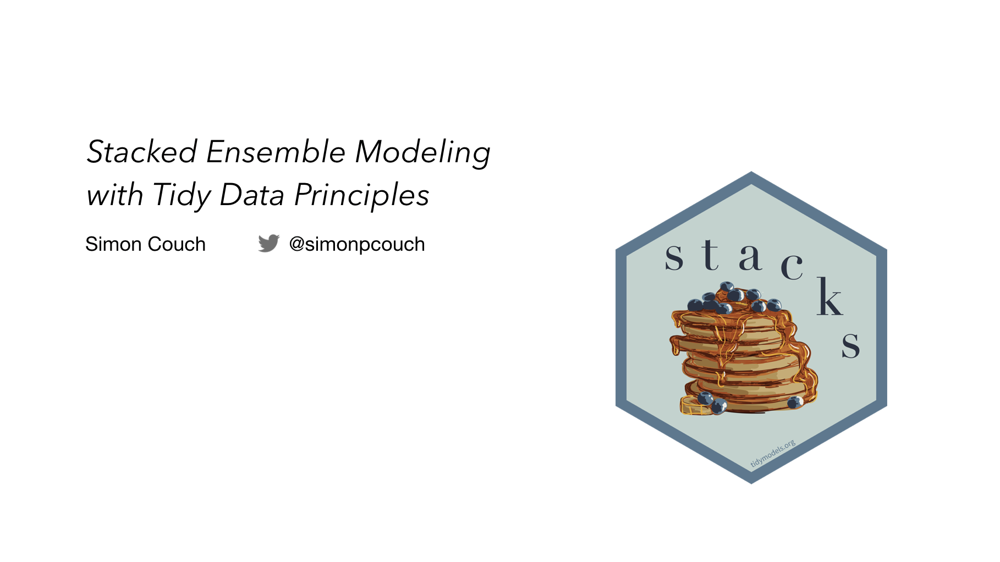

Source code and slides for my talk "Stacked Ensemble Modeling with Tidy Data Principles" at the Salt Lake City R User Group April 2021 meeting.

To read more about the tidymodels, check out the ["Tidy Modeling with R"](https://www.tmwr.org/) book. 

To read more about stacks, check out [the package's website](https://stacks.tidymodels.org/).
